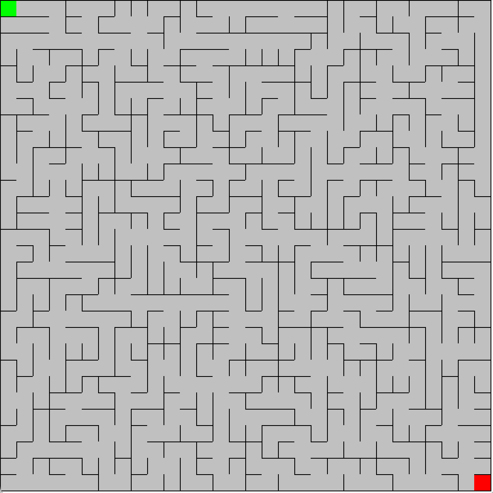
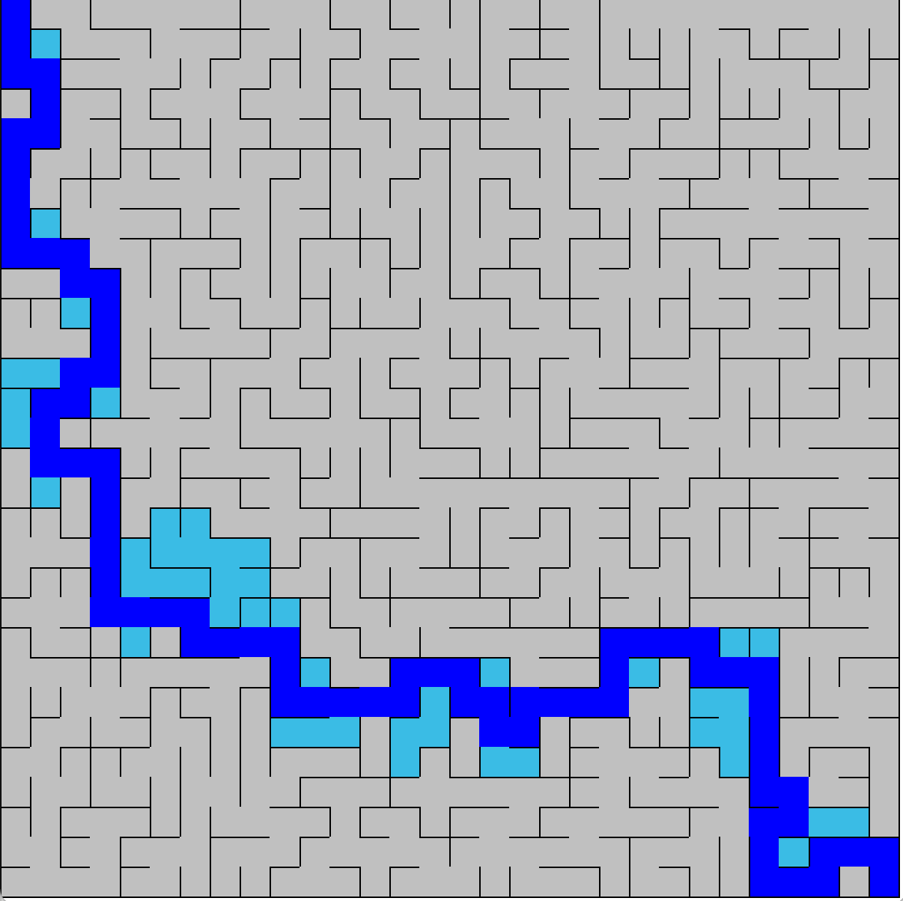
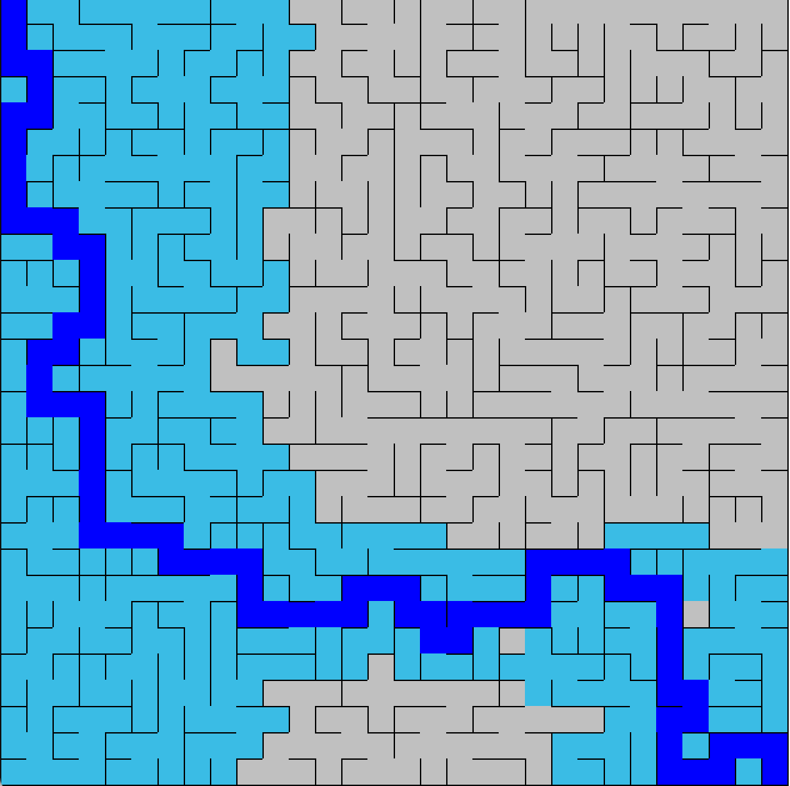

# **Maze Generation and Pathfinding**

This is a maze generation and pathfinding application. The app uses Kruskal's algorithm to generate a maze with dimensions that range from as little as 2 by 2, all the way up to 100 by 100. These dimensions can be specified by the user. After generating the maze, the user has options to solve the maze. They can either solve it using a depth first search (DFS) by clicking 'd' or a breadth first search (BFS) by clicking 'b'. Users also have the option to clear the current maze with 'c' and to generate a new maze with 'r'. In both the DFS and BFS, the search is animated step-by-step and the final path is retraced. 

### Final Product
The picture below shows a randomly generated maze. The starting point is green and the end is red. 
    

The picture below a maze that has been solved with a depth first search. The path to the end is in dark blue.blue.  
    

The picture below a maze that has been solved with a breadth first search. The path to the end is in dark blue.  
  
